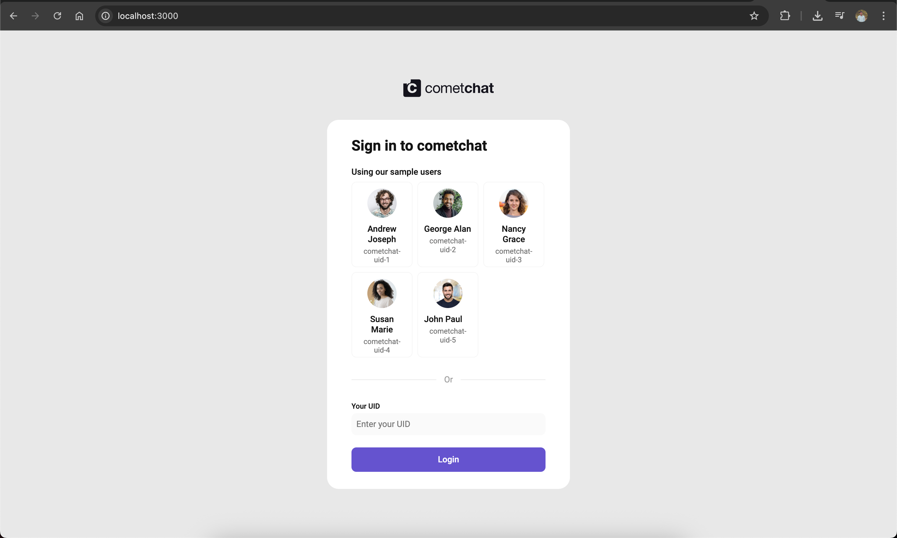

<p align="center">
  
</p>

# 🚀 CometChat UI Kit Integration

## 📋 Project Overview
This project demonstrates the integration of **CometChat’s UI Kit** into a React application to enable real-time chat functionalities with minimal setup.

Using CometChat’s powerful and customizable components, this application allows users to experience seamless messaging, group chats, and user management.

---

## 🛠️ Tech Stack
- Framework: **React**
- CometChat UI Kit

---

## 🚀 Getting Started

### 1. Clone the repository
```bash
git clone https://github.com/tomkndn/chat-application
cd chat-application
```

### 2. Install dependencies
```bash
npm install
```

### 3. Set up environment variables
Create a `.env` file in the project root and add:
```
REACT_APP_COMETCHAT_APP_ID=your-app-id
REACT_APP_COMETCHAT_REGION=your-app-region
REACT_APP_COMETCHAT_AUTH_KEY=your-auth-key
```
### 4. Run the application
```bash
npm run start
```

Visit [http://localhost:3000](http://localhost:3000) to see the app running.

---

## 📸 Screenshots

| Login Screen | Chat Interface |
|:------------:|:--------------:|
|  |  |

---

## ❗ Challenges and Solutions

### Authentication Setup
**Challenge:** Configuring CometChat authentication with app credentials.  
**Solution:** Verified App ID, Region, and Auth Key from CometChat Dashboard and rechecked the setup steps from documentation.

### UI Customization
**Challenge:** Minor styling conflicts with the default UI components.  
**Solution:** Scoped custom CSS carefully to override only necessary parts without affecting core functionality.

---

## 📚 Useful Resources
- [CometChat Documentation](https://www.cometchat.com/docs/)
- [CometChat UI Kit GitHub Repository](https://github.com/cometchat-pro)

---

## ✨ Final Thoughts
CometChat’s UI Kit provides an incredibly simple yet powerful way to add real-time chat to any application.  
The integration process was straightforward, and the customization flexibility makes it ideal for any project scale.

---